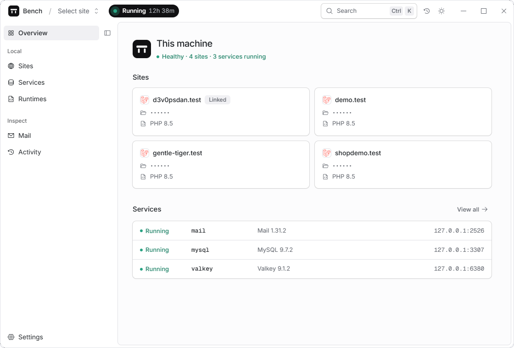
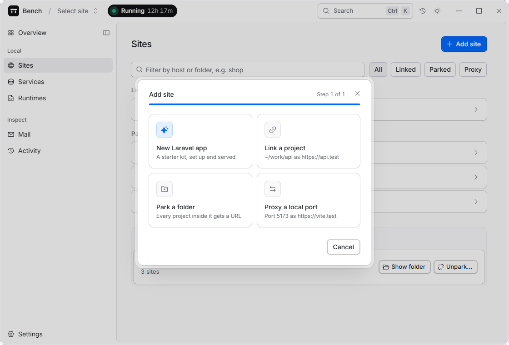
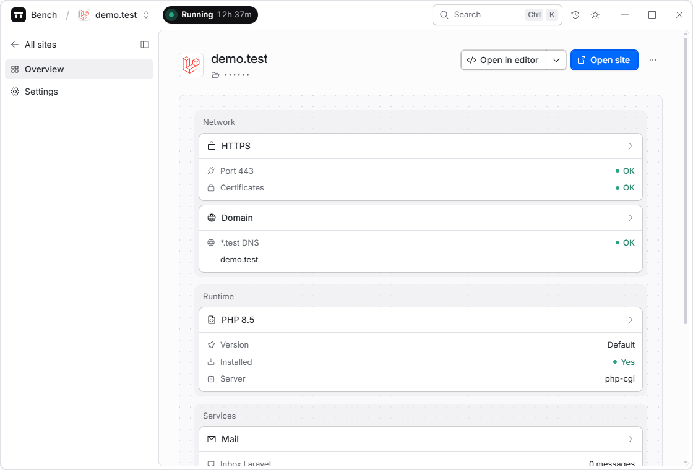
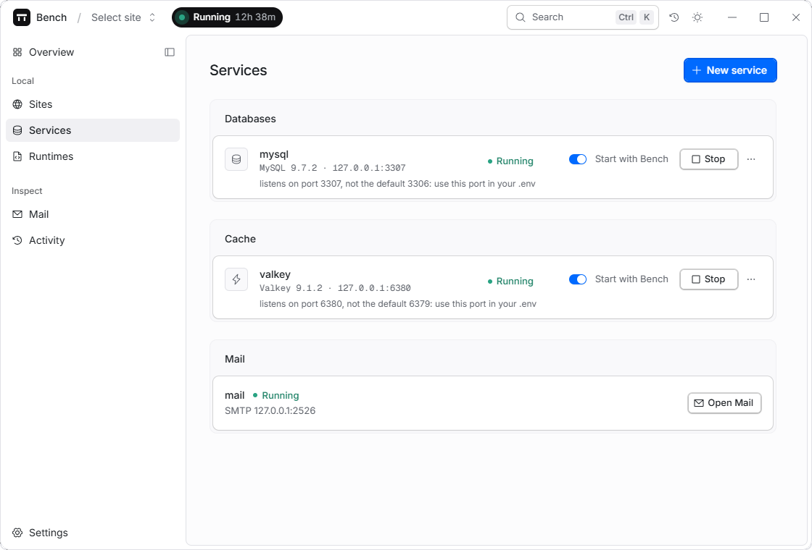
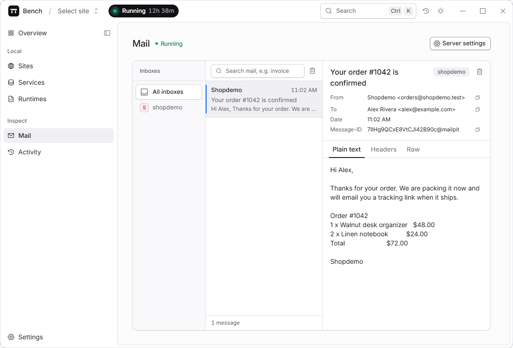
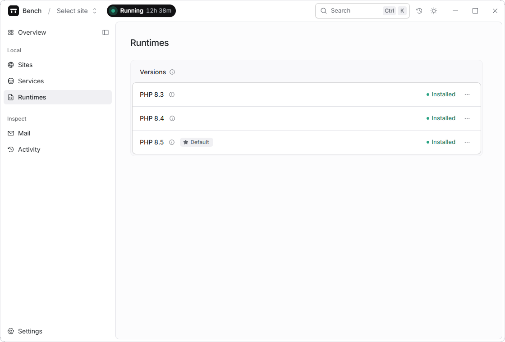
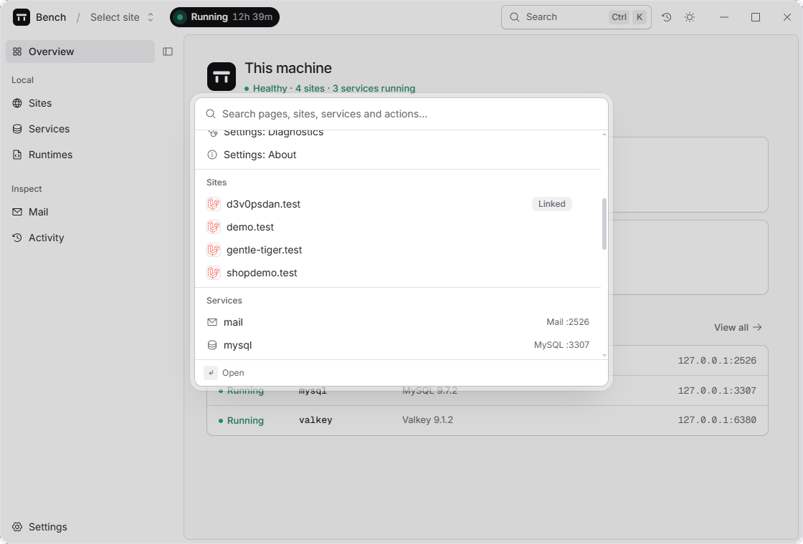

# Bench

Bench is a free, open-source local development environment for Laravel and PHP on Windows, macOS and Linux. It serves your apps at `https://<name>.test`, runs several PHP versions side by side, and gives each project its own databases, cache, search, S3 storage and mail inbox. Everything runs as native binaries, managed from a desktop app or the `bench` CLI.

- **No containers.** PHP, the web server and every service are native processes, so there is no Docker, no Homebrew and no container filesystem slowing down your app.
- **Local only.** Bench runs your development machine. It doesn't deploy or host anything.
- **Sites outlive the app.** A small background service (`benchd`) does the work, so closing the window never stops your sites.



## What you get

Works today:

- PHP 8.3 to 8.5 side by side, a global default and per-site pinning
- `*.test` domains with trusted HTTPS and no per-site setup
- MySQL, MariaDB, PostgreSQL, Valkey (Redis), Meilisearch and RustFS (S3), each started, stopped and cloned in one click
- Mail catching with a per-project inbox, read in the app
- Reverse proxies from `https://<name>.test` to any local port
- A new Laravel app wizard (`bench new`) that asks what `laravel new` asks, with Composer bundled
- A command palette, an Activity tray for long tasks, and a privacy mode that hides site names, folders and secrets when you share your screen

Planned: dumps (`dump()`, `dd()`, Ray), a log viewer, Xdebug detection and a profiler, and a per-site runner for `queue`, `pail` and Vite. [ROADMAP.md](ROADMAP.md) has the order.

## Screenshots

| Add a site four ways | Each site's health, runtime and services |
|---|---|
|  |  |
| **Services with their real ports** | **Mail caught per project** |
|  |  |
| **PHP versions side by side** | **Everything from the keyboard** |
|  |  |

## Install

Download the installer for your OS from the [releases page](https://github.com/d3v0psdan/bench/releases). Installers bundle the app, `benchd`, the `bench` CLI and `bench-helper`.

Beta installers are unsigned, so Windows SmartScreen and macOS Gatekeeper ask you to confirm the first launch.

On first run, the Overview page walks you through installing PHP and one admin prompt that routes `*.test` to your machine and trusts Bench's local HTTPS certificates. [INSTRUCTIONS.md](INSTRUCTIONS.md) covers everyday use: adding sites, services, mail, the CLI and troubleshooting.

Already running Laravel Herd? Both can stay installed; Bench moves its services to free ports and tells you which. See [docs/herd-coexistence.md](docs/herd-coexistence.md).

## Build from source

You need Go 1.26+, Node 22+, [Bun](https://bun.sh) and Rust stable with the [Tauri prerequisites](https://v2.tauri.app/start/prerequisites/) for your OS.

1. Build the daemon and CLI, and start the daemon:

   ```sh
   cd daemon
   go build -o bin/ ./cmd/...
   ./bin/bench start     # starts benchd in the background
   ./bin/bench status    # confirms it's listening on 127.0.0.1
   ```

2. Run the desktop app:

   ```sh
   cd ../app
   bun install
   bun run tauri dev                  # hot reload, or:
   bun run tauri build --no-bundle    # release binary in src-tauri/target/release/
   ```

3. Put `benchd` next to the app executable, so the app's Start button can find it (installers do this for you):

   ```sh
   # from the repo root; drop .exe outside Windows
   cp daemon/bin/benchd.exe app/src-tauri/target/debug/     # for tauri dev
   cp daemon/bin/benchd.exe app/src-tauri/target/release/   # for a release build
   ```

All state (API token, site registry, logs) lives under `~/.bench/`. Set `BENCH_HOME` to move it.

## How it works

```
Desktop app (Tauri 2 + React)  ─┐
bench CLI                      ─┼─► benchd, a Go daemon that supervises:
                                    Caddy (routing, local HTTPS) · PHP per version
                                    native service binaries · *.test DNS · SQLite registry
```

The app and the CLI are both clients of `benchd`'s localhost API, so anything the app does, the CLI can do too. [PLAN.md](PLAN.md) has the architecture and the decisions behind it.

## Status

Alpha. Serving sites, PHP versions, services and mail are done on all three OSes; the desktop app and Laravel tooling are being finished now, and debugging tools come last. Bug reports from real projects, especially on Windows and Linux, are the most useful thing you can send.

## Help and contributing

Questions and bug reports go in [GitHub issues](https://github.com/d3v0psdan/bench/issues). See [CONTRIBUTING.md](CONTRIBUTING.md) for setup, conventions and how to send a change, and [SECURITY.md](SECURITY.md) to report a vulnerability privately.

## License

[MIT](LICENSE). Bench is an independent project, not affiliated with or endorsed by Laravel Holdings Inc. "Laravel" is their trademark.
